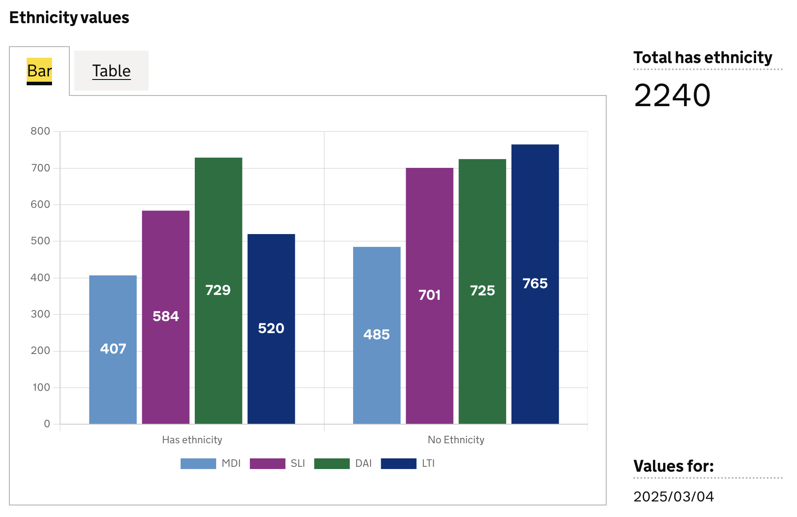

# Bar Chart Visualisation Type

The `bar` chart visualisation type represents data as a bar chart visualisation.

Charts are accompanied by a table/list representation of the underlying chart data. 

## When to use

Use this visualisation type when you need to display data as a bar chart. 

## Visualisation Definition Structure

```js
{
  id: 'bar-definition-example',
  type: 'bar',
  display: 'bar title',
  description: 'bar visualisation description',
  columns: {
    ...
  }
}
```
## Examples

### Define dataset columns as bar labels

In this example we will define the which dataset columns to use in the bar chart as follows:

- each column will be new bar in the chart
- the column value will be represented as the size of the bar
- each row will be a new dataset in the chart

For example, given we have a dashboard dataset like this:

```
| est_id | has_ethnicity | ethnicity_is_missing | has_religion | religion_is_missing |
|--------|---------------|----------------------|--------------|---------------------|
| MDI    | 407           | 485                  | 300          | 500                 |
| SLI    | 584           | 701                  | 280          | 320                 |
| LTI    | 729           | 725                  | 220          | 214                 |
| DAI    | 520           | 765                  | 220          | 214                 |
```

and a definition as follows:

```js
{
  id: 'metric-bar-example',
  type: 'bar',
  display: 'Ethnicity values',
  description: '',
  columns: {
    keys: [
      {
        id: 'est_id',
        display: 'Establishment ID'
      }
    ],
    measures: [
      {
        id: 'has_ethnicity',
        display: 'Has ethnicity',  
      },
      {
        id: 'ethnicity_is_missing',
        display: 'No ethnicity',  
      },
    ],
  },
}
```

This definition will return the following dataset (see [here](./visualisation-definition.md#targeting-data-in-a-dataset) for more info on targeting data):

```
| est_id | has_ethnicity | ethnicity_is_missing |
|--------|---------------|----------------------|
| MDI    | 407           | 485                  | 
| SLI    | 584           | 701                  |
| LTI    | 729           | 725                  |
| DAI    | 520           | 765                  |
```

And produce this bar chart visualisation:




### Dataset values as labels 

In this example we will use values in a specific column for the bar labels, and use another column as the values for the bar.

Here we can define the `axis` field on the specific dataset columns we want to use for the labels (`x`), and their corresponding values (`y`)

For example, given we have a dashboard dataset like this:

```
| ts         |  est_id  | wing  | cell  | diet        | count | 
|------------|----------| ------|-------|-------------|-------|
| 2025/02/25 |          |       |       |             | 5000  |
| 2025/02/25 | MDI      |       |       |             | 1109  |
| 2025/02/25 |          |       |       | vegetarian  | 1507  |
| 2025/02/25 |          |       |       | Pescatarian | 1130  |
| 2025/02/25 |          |       |       | Vegan       | 1354  |
| 2025/02/25 |          |       |       | Omnivore    | 1009  |
| 2025/02/25 | MDI      |       |       | vegetarian  | 169   |
| 2025/02/25 | MDI      |       |       | Pescatarian | 463   |
| 2025/02/25 | MDI      |       |       | Vegan       | 397   |
| 2025/02/25 | MDI      |       |       | Omnivore    | 80    |
```

and this definition:

```js
{
  id: 'bar-diet-totals',
  type: 'bar',
  display: 'Diet totals as bar chart',
  description: '',
  columns: {
    keys: [],
    measures: [
      {
        id: 'diet',
        display: 'Diet',
        axis: 'x',    // <-- column whose values are used as bar labels
      },
      {
        id: 'count',
        display: 'Total prisoners',
        axis: 'y',    // <-- column whose values are used as the bar size
      },
    ],
    expectNulls: true,
  },
}
```

This definition will return the following dataset (see [here](./visualisation-definition.md#targeting-data-in-a-dataset) for more info on targeting data).
```
| ts         |  est_id  | wing  | cell  | diet        | count | 
|------------|----------| ------|-------|-------------|-------|
| 2025/02/25 |          |       |       | vegetarian  | 1507  |
| 2025/02/25 |          |       |       | Pescatarian | 1130  |
| 2025/02/25 |          |       |       | Vegan       | 1354  |
| 2025/02/25 |          |       |       | Omnivore    | 1009  |
```

to produce this bar chart. 


```
