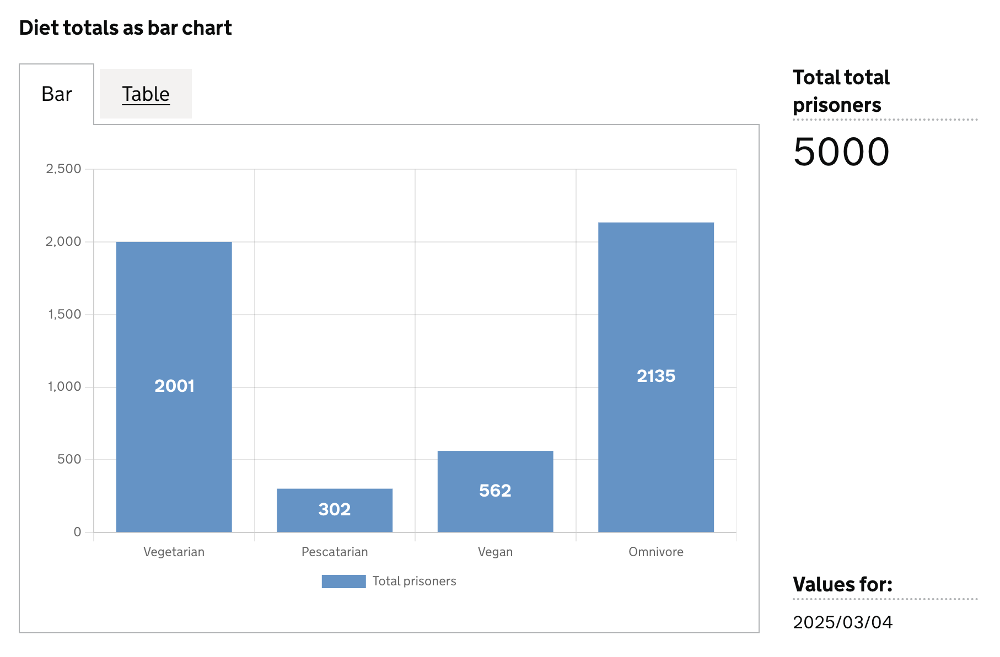

The `line` chart visualisation type represents data as a matrix/heatmap chart visualisation.

- [When to use](#when-to-use)
- [When not to use](#when-not-to-use)
- [How it works](#how-it-works)
- [Definition](#definition)
- [Data assumptions](#data-assumptions)
- [Examples](#examples)

<hr class='dpr-docs-hr'/>

# When to use

Use a line chart when you want to show how a value changes across a continuous scale that is not limited to time. Line charts are ideal for highlighting patterns, progression, and relationships in continuous data.
Choose a line chart when:

- Your data is continuous, but not necessarily temporal (e.g., distance, position, percentages along a range).
- You want to show how values progress along a measurement scale.
- The shape or direction of change matters, such as steady increase, decrease, or curvature.
- You are comparing multiple continuous series on the same scale.
- The focus is on the relationship between points, not individual standalone values.

Use a line chart when you need continuity without implying time‑based trends.

<hr class='dpr-docs-hr'/>

# When not to use

Avoid using a line chart when:

- Your data is categorical, such as names, departments, or discrete labels.
- The values are unrelated or non‑continuous, making connecting them with a line misleading.
- You need to compare individual values, not the relationship between them — a bar or column chart is clearer.
- There are very few data points (e.g., 2–3); the line adds no meaningful shape or trend.
- Your x‑axis is time‑based and you need time‑specific formatting, scaling, or handling — use a line‑timeseries chart instead.
- The data includes gaps or missing intervals, which can distort the interpretation of continuity.

### Note:

If your data represents values over time, use a `line‑timeseries` chart instead. It provides time‑aware scaling, formatting, and interpretation specifically designed for temporal datasets.

<hr class='dpr-docs-hr'/>

# Definition

```js
{
  id: 'id',
  type: 'line',
  display: 'name',
  description: 'description',
  option: {
    ...
  }
  column: {
    ...
  }
}
```

See the [Visualisation definition](/dashboards/visualisations/visualisation-definition) docs for the definition schema

See the [Targeting data](/dashboards/visualisations/visualisation-dataset) for and how to target data with the `column`

<hr class='dpr-docs-hr'/>

# Examples

- [Example 1](#example-1)
- [Example 2](#example-2)

### Example Dataset

```js

| ts         |  est_id  | wing  | cell  | finds       | count |
|------------|----------| ------|-------|-------------|-------|
| 2025/02/25 |          |       |       |             | 81    |
| 2025/02/25 |          |       |       | Drugs       | 17    |
| 2025/02/25 |          |       |       | Phones      | 22    |
| 2025/02/25 |          |       |       | Weapons     | 26    |
| 2025/02/25 |          |       |       | Alcohol     | 16    |
```

<hr class='dpr-docs-hr'/>

# Example 1

TBD

### Definition

```js
{
  id: 'example-1',
  type: 'vis-type',
  display: 'Example definition',
  description: 'Example definition description',
  option: {},
  column: {
    key: [],
    measure: [],
    filter: []
    expectNull: true,
  },
}
```

### Visualisation dataset

This definition will return the following dataset

```js

```

see [here](/dashboards/visualisations/visualisation-dataset) for more info on targeting data

<hr class='dpr-docs-hr'/>

### Visualisation


<hr class='dpr-docs-hr'/>

# Example 2

TBD

### Definition

```js
{
  id: 'example-1',
  type: 'vis-type',
  display: 'Example definition',
  description: 'Example definition description',
  option: {},
  column: {
    key: [],
    measure: [],
    filter: []
    expectNull: true,
  },
}
```

### Visualisation dataset

This definition will return the following dataset

```js

```

see [here](/dashboards/visualisations/visualisation-dataset) for more info on targeting data

<hr class='dpr-docs-hr'/>

### Visualisation


