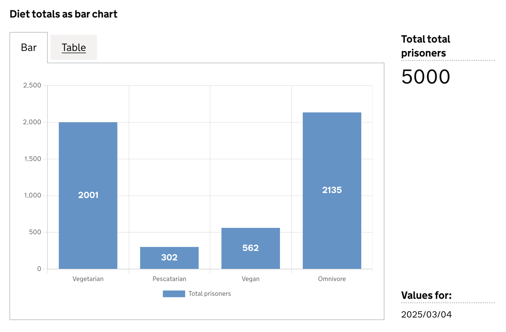

🚧 This section is a work in progress 🚧


The `line` chart visualisation type represents data as a matrix/heatmap chart visualisation. 

- [When to use](#when-to-use)
- [How it works](#how-it-works)
- [Definition](#definition)
- [Data assumptions](#data-assumptions)
- [Examples](#examples)

<hr class='dpr-docs-hr'/>

# When to use

TBD

<hr class='dpr-docs-hr'/>

# How it works

TBD

<hr class='dpr-docs-hr'/>

# Definition

```js
{
  id: 'id',
  type: 'line',
  display: 'name',
  description: 'description',
  option: {
    ...
  }
  column: {
    ...
  }
}
```
  See the [Targeting data](/dashboards/visualisations/targeting-data) for and how to target data with the `column`

<hr class='dpr-docs-hr'/>

# Examples

- [Example 1](#example-1)
- [Example 2](#example-2)

### Example Dataset

```js

| ts         |  est_id  | wing  | cell  | finds       | count | 
|------------|----------| ------|-------|-------------|-------|
| 2025/02/25 |          |       |       |             | 81    |
| 2025/02/25 |          |       |       | Drugs       | 17    |
| 2025/02/25 |          |       |       | Phones      | 22    |
| 2025/02/25 |          |       |       | Weapons     | 26    |
| 2025/02/25 |          |       |       | Alcohol     | 16    |
```

<hr class='dpr-docs-hr'/>


# Example 1

TBD

### Definition

```js
{
  id: 'example-1',
  type: 'vis-type',
  display: 'Example definition',
  description: 'Example definition description',
  option: {},
  column: {
    key: [],
    measure: [],
    filter: []
    expectNull: true,
  },
}
```

### Visualisation dataset

This definition will return the following dataset
```js

```
see [here](/dashboards/visualisations/targeting-data) for more info on targeting data

<hr class='dpr-docs-hr'/>

### Visualisation


<hr class='dpr-docs-hr'/>

# Example 2

TBD

### Definition

```js
{
  id: 'example-1',
  type: 'vis-type',
  display: 'Example definition',
  description: 'Example definition description',
  option: {},
  column: {
    key: [],
    measure: [],
    filter: []
    expectNull: true,
  },
}
```

### Visualisation dataset

This definition will return the following dataset
```js

```
see [here](/dashboards/visualisations/targeting-data) for more info on targeting data

<hr class='dpr-docs-hr'/>

### Visualisation


