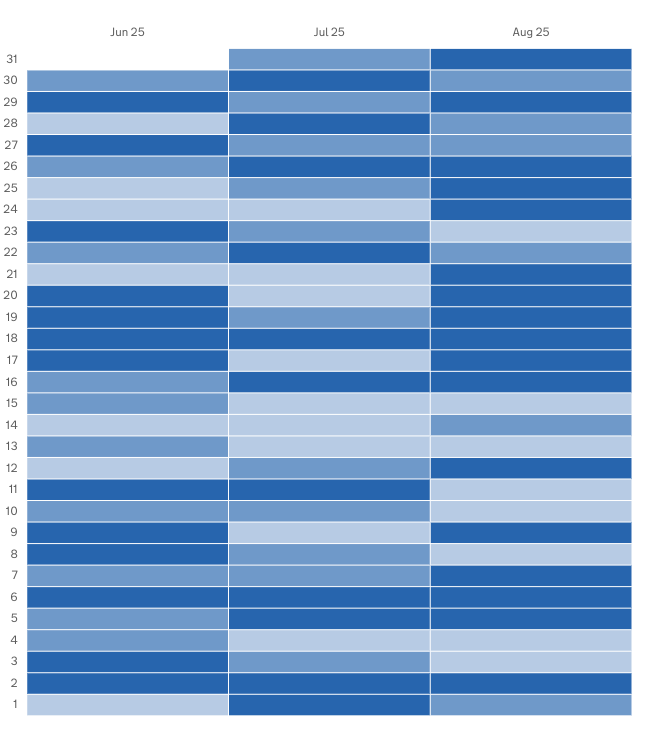
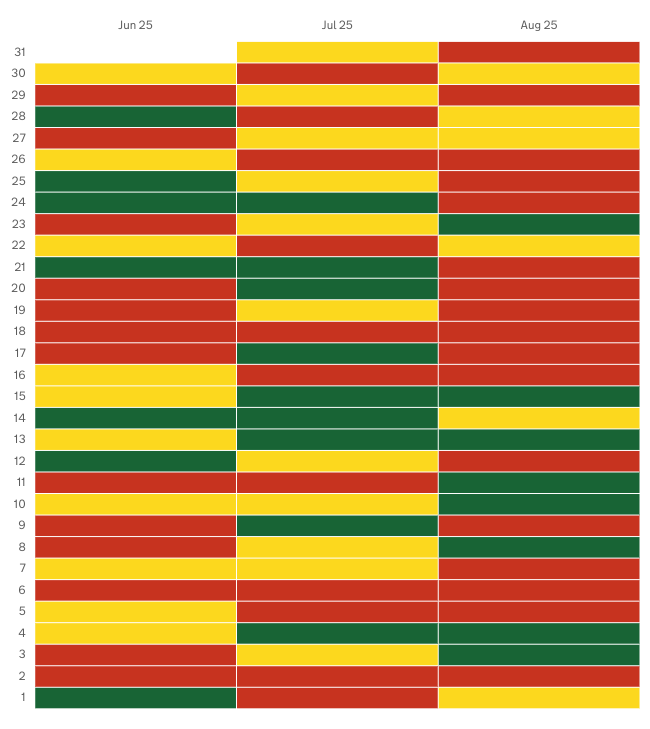

The `matrix-timeseries` chart visualisation type represents data as a matrix/heatmap chart visualisation.

Charts are accompanied by a table/list representation of the underlying chart data. 

## When to use

Use this visualisation type when you need to display historic data in as a heatmap, or traffic-light matrix. 

## How it works

This chart uses colour to represent data as two dimensional matrix. Values in a dataset can be assigned colours in few ways value. 

### Using the RAG value 

If RAG values are present in the data
- The max RAG value is used to determine the total number of buckets.
- There is no upper limit to the number of buckets created.
- Each bucket is assigned and specific colour and an index starting from 0.
- Each RAG value is assigned to their corresponding bucket. 

### Custom threshold bucketing

If no RAG value is in the dataset: 
- Buckets are defined by determining the data range and splitting it into 3 equal parts.
- Each bucket is assigned a specific colour
- Each value is put into the appropriate bucket

## Buckets colours

### Red, Amber or Green

Use RAG when:

- You have 3 buckets
- You're visualising performance, status, or compliance data.
- Quick identification of "bad" areas in the primary goal.
- Your audience expects traffic-light conventions.

### Heatmaps

This is gradient variations of a base colour. User heatmap colouring when

- You need many buckets for fine grained data
- You're showing purely quantative data.
- When there are no natural thresholds. There are no meaningful good, warning, or bad thresholds.
 

## Definition

```js
{
  id: 'line-definition-example',
  type: 'matrix-timeseries',
  display: 'Matrix timeseries chart',
  description: 'Matrix visualisation description',
  options: {
    ...
  }
  columns: {
    ...
  }
}
```
  To learn more about defining the data for the visualisation using the `columns` field see [here](/dashboards/visualisations/targeting-data)

### Options: 

```js
options: {
  useRagColours: true,
}
```


# Examples

- [Define a timeseries matrix chart](#define-a-timeseries-matrix-chart)
- [Define a timeseries RAG matrix chart](#define-a-timeseries-rag-matrix-chart)

### Example Dataset

For these examples we will use a mocked dataset representing finds totals

```js

| ts         |  est_id  | wing  | cell  | finds       | count | 
|------------|----------| ------|-------|-------------|-------|
| 2025/02/25 |          |       |       |             | 81    |
| 2025/02/25 |          |       |       | Drugs       | 17    |
| 2025/02/25 |          |       |       | Phones      | 22    |
| 2025/02/25 |          |       |       | Weapons     | 26    |
| 2025/02/25 |          |       |       | Alcohol     | 16    |
| 2025/02/24 |          |       |       |             | 69    |
| 2025/02/24 |          |       |       | Drugs       | 11    |
| 2025/02/24 |          |       |       | Phones      | 9     |
| 2025/02/24 |          |       |       | Weapons     | 30    |
| 2025/02/24 |          |       |       | Alcohol     | 19    |
| 2025/02/23 |          |       |       |             | 92    |
| 2025/02/23 |          |       |       | Drugs       | 14    |
| 2025/02/23 |          |       |       | Phones      | 22    |
| 2025/02/23 |          |       |       | Weapons     | 49    |
| 2025/02/23 |          |       |       | Alcohol     | 7     |
... more rows ommitted

```

<hr/>

# Define a timeseries matrix chart

In this example we will define a matrix chart that:

- selects the dataset rows that show the total count of finds for each day
- represent that as a matrix chart that show daily finds over 3 months

### Definition

```js
{
  id: 'finds-totals--overtime',
  type: 'matrix-timeseries',
  display: 'Finds totals over time matrix chart',
  description: '',
  options: {},
  columns: {
    keys: [
      {
        id: 'ts',
      },
    ],
    measures: [
      {
        id: 'ts',
        display: 'Date',
      },
      {
        id: 'count',
        display: 'Total finds',
      },
    ],
    expectNulls: true,
  },
}
```

### Dataset returned: 

```js
| ts         |  est_id  | wing  | cell  | finds       | count | 
|------------|----------| ------|-------|-------------|-------|
| 2025/02/25 |          |       |       |             | 81    |
| 2025/02/24 |          |       |       |             | 69    |
| 2025/02/23 |          |       |       |             | 92    |
... more rows ommitted
```

### Matrix visualisation




<hr/>

# Define a timeseries RAG matrix chart

In this example we will define a matrix chart that:

- selects the dataset rows that show the total count of finds for each day
- represent that as a matrix chart that show daily finds over 3 months
- Uses RAG colouring

### Definition

```js
{
  id: 'finds-totals--overtime',
  type: 'matrix-timeseries',
  display: 'Finds totals over time matrix chart',
  description: '',
  options: {
    useRagColours: true // <- Defines the use of RAG colouring
  },
  columns: {
    keys: [
      {
        id: 'ts',
      },
    ],
    measures: [
      {
        id: 'ts',
        display: 'Date',
      },
      {
        id: 'count',
        display: 'Tota finds',
      },
    ],
    expectNulls: true,
  },
}
```

### Dataset returned: 

```js
| ts         |  est_id  | wing  | cell  | finds       | count | 
|------------|----------| ------|-------|-------------|-------|
| 2025/02/25 |          |       |       |             | 81    |
| 2025/02/24 |          |       |       |             | 69    |
| 2025/02/23 |          |       |       |             | 92    |
... more rows ommitted
```

### Matrix visualisation



<hr/>

# Weapons finds total over time

In this example we will define a matrix chart that:

- selects the dataset rows that show the total count of finds for each day
- represent that as a matrix chart that show weapon finds over 3 months
- Uses RAG colouring

### Definition

```js
{
  id: 'finds-totals--overtime',
  type: 'matrix-timeseries',
  display: 'Finds totals over time matrix chart',
  description: '',
  columns: {
    keys: [
      {
        id: 'ts',
      },
    ],
    measures: [
      {
        id: 'ts',
        display: 'Date',
      },
      {
        id: 'count',
        display: 'Weapons found',
      },
    ],
    filters: [
      {
        id: 'finds',
        equals: 'Weapons'
      }
    ]
    expectNulls: true,
  },
}
```

### Dataset returned: 

```js
| ts         |  est_id  | wing  | cell  | finds       | count | 
|------------|----------| ------|-------|-------------|-------|
| 2025/02/25 |          |       |       | Weapons     | 26    |
| 2025/02/24 |          |       |       | Weapons     | 30    |
| 2025/02/23 |          |       |       | Weapons     | 49    |
... more rows ommitted
```

### Matrix visualisation


