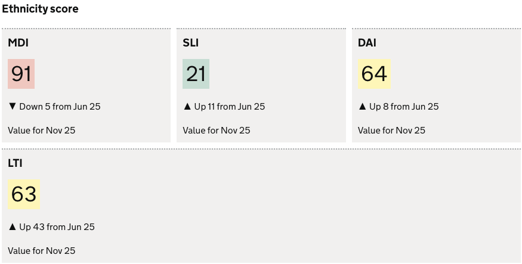

The `scorecard-group` chart visualisation type represents data as a collection `scorecard` visualisations in a group. 

A scorecard is used to display:

- A **snapshot value** of a data point at a specific point in time.
- The data **trend** over time, within a user selected date range.
- The RAG **score/status** for the presented value.

**contents**

- [When to use](#when-to-use)
- [How it works](#how-it-works)
- [Definition](#definition)
- [Data assumptions](#data-assumptions)
- [Examples](#examples)

<hr class='dpr-docs-hr'/>

# When to use

Use scorecard group when:

- You want to display a group of scorecards
- You want multiple rows in a data subset displayed as scorecards 

<hr class='dpr-docs-hr'/>

# How it works

A scorecard group uses multiple rows in the returned dataset to create the visualisation. 

See the [scorecard](/dashboards/visualisations/scorecard) for details on how a scorecard works

<hr class='dpr-docs-hr'/>

# Definition

```js
{
  id: 'scorecard-group-definition-example',
  type: 'scorecard-group',
  display: 'Scorecard Group title',
  description: 'scorecard-group visualisation description',
  options: {
    ...
  }
  columns: {
    ...
  }
}
```

See the [Targeting data](/dashboards/visualisations/targeting-data) for and how to target data with the `column`

### Options: 

See [Custom buckets](/dashboards/visualisations/custom-buckets##custom-buckets) for `options` documentation 


<hr class='dpr-docs-hr'/>

# Examples

These examples demonstrate how to present multiple rows within a dataset as a scorecard group.

- [Scoregroup from list data](#scoregroup-from-list-data)
- [Scoregroup from columms](#example-2)

### Example Dataset

For these examples we will use a mocked dataset representing data quality totals. 

```js
| ts         | est_id | has_nationality | has_ethnicity | has_religion | religion_is_missing |
|------------|--------|-----------------|---------------|--------------|---------------------|
| Jun 25.    | MDI    | 21              | 91            | 54           | 63                  |
| Jun 25.    | SLI    | 34              | 21            | 12           | 12                  |
| Jun 25.    | DAI    | 86              | 64            | 36           | 87                  |
| Jun 25.    | LTI    | 23              | 63            | 87           | 54                  |
... omitted past ts data
```

<hr class='dpr-docs-hr'/>


# Scoregroup from list data

The example creates a scorecard group using values in a list. We will be showing ethnicity metrics by establishment ID.

To do this we define 2 measures
- the column we want to use as the list: `est_id`
- the column we want to use as the numeric value: `has_ethnicity`

We must also define `displayValue` in the `measure` for the numeric value to display:
- Informs which column the numeric value should be taken from, and which is the description column. 
- Informs that the group is to be generated from a list 

In this dataset we have 4 unique values for `est_id`, therefore we will have 4 scorecards in our group

### Definition

```js
{
  id: 'data-quality-ethnicity',
  type: 'scorecard-group',
  display: 'Ethnicity score',
  description: '',
  options: {
    useRagColours: true,
    buckets: [{ min: 0, max: 500 }, { min: 501, max: 700 }, { min: 701 }],
  },
  columns: {
    keys: [{ id: 'establishment_id' }],
    measures: [
      {
        id: 'establishment_id',       // defines the value to use as the scorecard title
        display: ''                   // optional prefix display value
      },
      {
        id: 'has_ethnicity',
        displayValue: true,           // defines the number value to display, that that this is a group from a list
      },
    ],
  },
}
```


### Visualisation



<hr class='dpr-docs-hr'/>

# Scoregroup from columms

The example demonstrates how to create a scorecard group using dataset columns as scorecard titles and values.
- Shows data quality metrics as a group for each establishment
- Defines all columns in the `measure` array that you want display, with a `display` field to add the scorecard title
- Each establishment is displayed as a new group


### Definition

```js
{
  id: 'data-quality-no-nationality',
  type: 'scorecard-group',
  display: 'Data quality scores',
  description: '',
  options: {
    buckets: [{ min: 0, max: 500 }, { min: 501, max: 700 }, { min: 701 }],
    useRagColours: true,
  },
  columns: {
    keys: [
      {
        id: 'establishment_id',
        display: 'Establishment ID',
      },
    ],
    measures: [
      {
        id: 'has_nationality',
        display: 'Has nationality',
      },
      {
        id: 'nationality_is_missing',
        display: 'Nationality is missing',
      },
      {
        id: 'religion_is_missing',
        display: 'Religion is missing',
      },
      {
        id: 'has_religion',
        display: 'Has religion',
      },
      {
        id: 'ethnicity_is_missing',
        display: 'Ethnicity is missing',
      },
      {
        id: 'has_ethnicity',
        display: 'Has ethnicity',
      },
    ],
  },
}
```

### Visualisation


<hr class='dpr-docs-hr'/>
