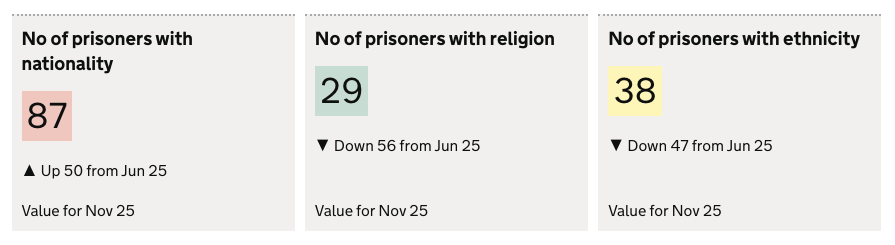
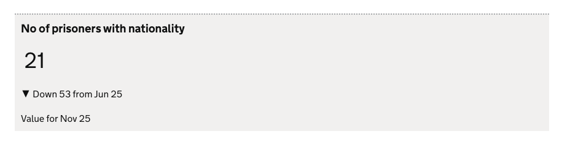
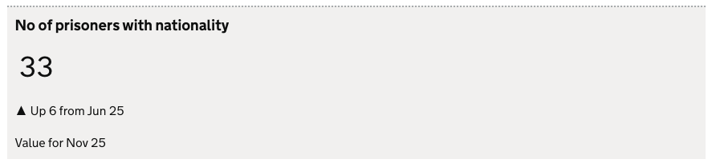
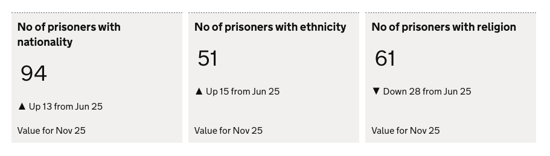
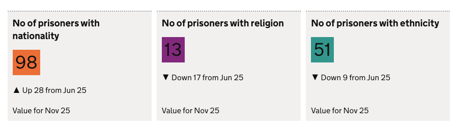
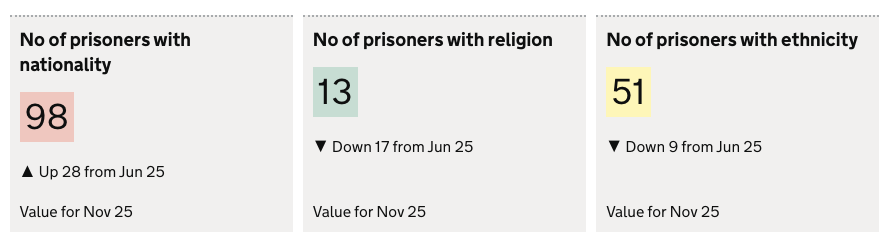

The `scorecard` chart visualisation type represents data as a scorecard. 

A scorecard is used to display:

- A **snapshot value** of a data point at a specific point in time.
- The data **trend** over time, within a user selected date range.
- The RAG **score/status** for the presented value.

**contents**

- [When to use](#when-to-use)
- [When not to use](#when-not-to-use)
- [How it works](#how-it-works)
- [Definition](#definition)
- [Data assumptions](#data-assumptions)
- [Examples](#examples)

<hr class='dpr-docs-hr'/>

# When to use

Use this visualisation type when:
- you need to display data as a **single** scorecard.
- you need to display a **single** column value as a scorecard

<hr class='dpr-docs-hr'/>

# When not to use

If you want to display a group of scorecards using a single visualisaton definition you should use [Scorecard group](/dashboards/visualisations/scorecard-group)

Use [Scorecard group](/dashboards/visualisations/scorecard-group) when:

- You have **multiple rows** in your visualisation dataset
- You want to display a group of scorecards

<hr class='dpr-docs-hr'/>

# How it works

## Snapshot value

The metric value and description is taken from the value in the single `measure` column provided in the definition 

## Data score

The data score is represented as a colour to denote its status.

See [Data Scoring & Bucketing](/dashboards/visualisations/custom-buckets) for docs on how data is scored and bucketed, and how to define custom buckets.  

If not data score or custom bucketing is found then the data score is not displayed.

## Trend

The trend data for the metric value is derived from the difference between the earliest and latest value in the dataset. 

If no timestamp data is found then the trend is not displayed

<hr class='dpr-docs-hr'/>

# Definition

```js
{
  id: 'scorecard-definition-example',
  type: 'scorecard',
  display: 'The description displayed in the scorecard',
  description: 'scorecard visualisation description',
  options: {
    ...
  }
  columns: {
    keys: [ ... ], 
    // Always expects only a single measure
    measures: [{ id: 'column-id' }]
  }
}
```

See the [Targeting data](/dashboards/visualisations/targeting-data) for and how to target data with the `column`

### Options: 

See [Custom buckets](/dashboards/visualisations/custom-buckets##custom-buckets) for `options` documentation 

<hr class='dpr-docs-hr'/>

# Data assumptions

- To display trend data, a column with an ID of `ts` must be present in the **parent data**

<hr class='dpr-docs-hr'/>

# Examples

- [Simple scorecard](#simple-scorecard)
- [Scorecard section](#scorecard-section)
- [Simple scorecard with filter](#simple-scorecard-with-filter)
- [Scorecard with filter for alternate dataset](#scorecard-with-filter-for-alternate-dataset)
- [RAG Scores](#rag-scores)
- [Custom bucket colours](#custom-bucket-colours)
- [Custom buckets](#custom-buckets)

<hr class='dpr-docs-hr'/>

# Simple scorecard

This exmaple demonstrates how to define a scorecard in its simplest form.

### Dataset

```js
| ts         | est_id | has_nationality | nationality_is_missing | has_religion | religion_is_missing |
|------------|--------|-----------------|------------------------|--------------|---------------------|
| Jun 25.    | MDI    | 21              | 485                    | 300          | 500                 |
| Jul 25.    | MDI    | 80              | 701                    | 280          | 320                 |
| Aug 25.    | MDI    | 56              | 725                    | 220          | 214                 |
| Sep 25     | MDI    | 30              | 765                    | 220          | 214                 |
| Oct 25.    | MDI    | 42              | 765                    | 220          | 214                 |
| Nov 25.    | MDI    | 74              | 765                    | 220          | 214                 |
```

### Definition

```js
{
  id: 'simple-scorecard',
  type: 'scorecard',
  display: 'No of prisoners with nationality',
  description: 'Example definition description',
  columns: {
    keys: [{ id: 'est_id' }],
    measures: [{ id: 'has_nationality' }],
  },
}
```

### Visualisation



<hr class='dpr-docs-hr'/>

# Simple scorecard with filter

The example demonstrates how to a define scorecard that get its value by using the `filter` field
- If the filter return no rows then the scorecard is not displayed.

### Dataset

```js
| ts         | est_id | has_nationality | has_religion |
|------------|--------|-----------------|--------------|
| Jun 25.    | MDI    | 21              | 485          |
| Jun 25.    | SLI    | 33              | 485          | 
| Jul 25.    | MDI    | 80              | 701          | 
| Jul 25.    | SLI    | 84              | 701          |
| Aug 25.    | MDI    | 56              | 725          | 
| Aug 25.    | SLI    | 34              | 725          | 
| Sep 25     | MDI    | 30              | 765          | 
| Sep 25     | SLI    | 36              | 765          |
| Oct 25.    | MDI    | 42              | 765          | 
| Oct 25.    | SLI    | 44              | 765          | 
| Oct 25.    | MDI    | 12              | 765          | 
| Oct 25.    | SLI    | 27              | 765          | 
```

### Definition

```js
{
  id: 'simple-scorecard',
  type: 'scorecard',
  display: 'No of prisoners with nationality',
  description: 'Example definition description',
  columns: {
    keys: [{ id: 'est_id' }],
    measures: [{ id: 'has_nationality' }],
    filters: [
      { 
        id: 'est_id', 
        equals: 'SLI' 
      }
    ],
  },
}
```

### Visualisation



<hr class='dpr-docs-hr'/>

# Scorecard with filter for alternate dataset

### Dataset

```js
| ts         | est_id | wing     | diet       | total  | 
|------------|--------|----------|------------|--------|
| Jun 25.    |        |          |            | 30     |
| Jun 25.    |        |          | Vegetarian | 12     |
| Jun 25.    |        |          | Vegan      | 8      |
| Jun 25.    |        |          | Omnivore   | 10     |
| Jun 25.    |  MDI   |          |            | 30     |
| Jun 25.    |  MDI   | north    |            | 15     |
| Jun 25.    |  MDI   | south    |            | 15     |
| Jun 25.    |  MDI   | north    | Vegetarian | 1      |
| Jun 25.    |  MDI   | north    | Vegan      | 5      |
| Jun 25.    |  MDI   | north    | Omnivore   | 9      |
| Jun 25.    |  MDI   | south    | Vegetarian | 11     |
| Jun 25.    |  MDI   | south    | Vegan      | 3      |
| Jun 25.    |  MDI   | south    | Omnivore   | 1      |
... omitted past ts rows. 
```

### Definition

```js
{
  id: 'section-2',
  display: 'Diet totals',
  description: '',
  visualisations: [
    {
      id: 'sc-diet-totals',
      type: 'scorecard',
      display: 'Total Vegetarians',
      columns: {
        keys: [],
        measures: [{ id: 'count' }],
        filters: [
          {
            id: 'diet',
            equals: 'Vegetarian',
          },
        ],
        expectNulls: true,
      },
    },
    {
      id: 'sc-diet-totals-by-wing',
      type: 'scorecard',
      display: 'Vegetarians in MDI, in North wing',
      columns: {
        keys: [{ id: 'establishment_id' }, { id: 'wing' }],
        measures: [{ id: 'count' }],
        filters: [
          {
            id: 'diet',
            equals: 'Vegetarian',
          },
          {
            id: 'establishment_id',
            equals: 'MDI',
          },
          {
            id: 'wing',
            equals: 'north',
          },
        ],
        expectNulls: true,
      },
    }
  ],
}
```

### Visualisation


<hr class='dpr-docs-hr'/>

# Scorecard section

Defining multiple `scorecard` visualisation types adjacent to each other within a section will create a scorecard group.

### Dataset

```js
| ts         | est_id | has_nationality | has_religion | has_ethnicity |
|------------|--------|-----------------|--------------|---------------|
| Jun 25.    | MDI    | 94              | 61           | 51            | 
| Jul 25.    | MDI    | 80              | 34           | 80            | 
| Aug 25.    | MDI    | 56              | 67           | 30            | 
| Sep 25     | MDI    | 30              | 56           | 67            | 
| Oct 25.    | MDI    | 42              | 43           | 42            |
| Nov 25.    | MDI    | 81              | 89           | 36            | 
```

### Definition

```js
{
  id: 'section-2',
  display: 'Data quality scorecards with RAG colours',
  description: '',
  visualisations: [
    {
      id: 'simple-scorecard-nationality',
      type: 'scorecard',
      display: 'No of prisoners with nationality',
      columns: {
        keys: [{ id: 'est_id' }],
        measures: [{ id: 'has_nationality' }],
      },
    },
    {
      id: 'simple-scorecard-ethnicity',
      type: 'scorecard',
      display: 'No of prisoners with ethnicity',
      columns: {
        keys: [{ id: 'est_id' }],
        measures: [{ id: 'has_ethnicity' }],
      },
    },
    {
      id: 'simple-scorecard-religion',
      type: 'scorecard',
      display: 'No of prisoners with religion',
      columns: {
        keys: [{ id: 'est_id' }],
        measures: [{ id: 'has_religion' }],
      },
    },
  ],
}
```
see [here](/dashboards/visualisations/targeting-data) for more info on targeting data

### Visualisation



<hr class='dpr-docs-hr'/>

# RAG Scores

This examples display RAG scores within the scorecard:
- defines `useRagColours: true` to enable RAG colouring.
- Assumes that the dataset contains a rag score through a scoring engine.

### Dataset

```js
| ts         | est_id | has_nationality | has_religion | has_ethnicity |
|------------|--------|-----------------|--------------|---------------|
| Jun 25.    | MDI    | 87              | 29           | 38            | 
| Jul 25.    | MDI    | 80              | 34           | 80            | 
| Aug 25.    | MDI    | 56              | 67           | 30            | 
| Sep 25     | MDI    | 30              | 56           | 67            | 
| Oct 25.    | MDI    | 42              | 43           | 42            |
| Nov 25.    | MDI    | 37              | 85           | 75            | 
```

### Definition

```js
{
  id: 'section-2',
  display: 'Data quality scorecards with RAG colous',
  description: '',
  visualisations: [
    {
      id: 'simple-scorecard-nationality',
      type: 'scorecard',
      display: 'No of prisoners with nationality',
      options: {
        useRagColours: true
      },
      columns: {
        keys: [{ id: 'est_id' }],
        measures: [{ id: 'has_nationality' }],
      },
    },
    {
      id: 'simple-scorecard-ethnicity',
      type: 'scorecard',
      display: 'No of prisoners with ethnicity',
      options: {
        useRagColours: true
      },
      columns: {
        keys: [{ id: 'est_id' }],
        measures: [{ id: 'has_ethnicity' }],
      },
    },
    {
      id: 'simple-scorecard-religion',
      type: 'scorecard',
      display: 'No of prisoners with religion',
      description: 'Example definition description',
      options: {
        useRagColours: true
      },
      columns: {
        keys: [{ id: 'est_id' }],
        measures: [{ id: 'has_religion' }],
      },
    },
  ],
},
```
see [here](/dashboards/visualisations/targeting-data) for more info on targeting data

### Visualisation


<hr class='dpr-docs-hr'/>

# Custom bucket colours 

Define custom colours to your buckets:
- Defines 3 buckets with custom `hexColour` values that define the bucket colour.
- Example sssumes that the dataset contains a rag score through a scoring engine.

### Dataset

```js
| ts         | est_id | has_nationality | has_religion | has_ethnicity |
|------------|--------|-----------------|--------------|---------------|
| Jun 25.    | MDI    | 94              | 61           | 51            | 
| Jul 25.    | MDI    | 80              | 34           | 80            | 
| Aug 25.    | MDI    | 56              | 67           | 30            | 
| Sep 25     | MDI    | 30              | 56           | 67            | 
| Oct 25.    | MDI    | 42              | 43           | 42            |
| Nov 25.    | MDI    | 81              | 89           | 36            | 
```

### Definition

```js
{
  id: 'section-2',
  display: 'Data quality scorecards with RAG colous',
  description: '',
  visualisations: [
    {
      id: 'simple-scorecard-nationality',
      type: 'scorecard',
      display: 'No of prisoners with nationality',
      options: {
        buckets: [
          { hexColour: '#912b88' }, 
          { hexColour: '#28a197' }, 
          { hexColour: '#f47738' }
        ],
      },
      columns: {
        keys: [{ id: 'est_id' }],
        measures: [{ id: 'has_nationality' }],
      },
    },
    {
      id: 'simple-scorecard-ethnicity',
      type: 'scorecard',
      display: 'No of prisoners with ethnicity',
      options: {
        buckets: [
          { hexColour: '#912b88' }, 
          { hexColour: '#28a197' }, 
          { hexColour: '#f47738' }
        ],
      },
      columns: {
        keys: [{ id: 'est_id' }],
        measures: [{ id: 'has_ethnicity' }],
      },
    },
    {
      id: 'simple-scorecard-religion',
      type: 'scorecard',
      display: 'No of prisoners with religion',
      options: {
        buckets: [
          { hexColour: '#912b88' }, 
          { hexColour: '#28a197' }, 
          { hexColour: '#f47738' }
        ],
      },
      columns: {
        keys: [{ id: 'est_id' }],
        measures: [{ id: 'has_religion' }],
      },
    },
  ],
},
```
see [here](/dashboards/visualisations/targeting-data) for more info on targeting data


### Visualisation



<hr class='dpr-docs-hr'/>

# Custom buckets

In this example custom buckets are defined in the definition to set the RAG scores for the scorecard value

### Dataset

```js
| ts         | est_id | has_nationality | has_religion | has_ethnicity |
|------------|--------|-----------------|--------------|---------------|
| Jun 25.    | MDI    | 94              | 61           | 51            | 
| Jul 25.    | MDI    | 80              | 34           | 80            | 
| Aug 25.    | MDI    | 56              | 67           | 30            | 
| Sep 25     | MDI    | 30              | 56           | 67            | 
| Oct 25.    | MDI    | 42              | 43           | 42            |
| Nov 25.    | MDI    | 81              | 89           | 36            | 
```

### Definition

```js
{
  id: 'section-2',
  display: 'Data quality scorecards with RAG colous',
  description: '',
  visualisations: [
    {
      id: 'simple-scorecard-nationality',
      type: 'scorecard',
      display: 'No of prisoners with nationality',
      options: {
        useRagColours: true,
        buckets: [
          { max: 40 }, 
          { min: 41, max: 60 }, 
          { min: 61 }
        ],
      },
      columns: {
        keys: [{ id: 'est_id' }],
        measures: [{ id: 'has_nationality' }],
      },
    },
    {
      id: 'simple-scorecard-ethnicity',
      type: 'scorecard',
      display: 'No of prisoners with ethnicity',
      options: {
        useRagColours: true,
        buckets: [
          { max: 50 }, 
          { min: 51, max: 55 }, 
          { min: 56 }
        ],
      },
      columns: {
        keys: [{ id: 'est_id' }],
        measures: [{ id: 'has_ethnicity' }],
      },
    },
    {
      id: 'simple-scorecard-religion',
      type: 'scorecard',
      display: 'No of prisoners with religion',
      options: {
        useRagColours: true,
        buckets: [
          { max: 20 }, 
          { min: 21, max: 70 }, 
          { min: 71 }
        ],
      },
      columns: {
        keys: [{ id: 'est_id' }],
        measures: [{ id: 'has_religion' }],
      },
    },
  ],
},
```

See [Custom buckets](/dashboards/visualisations/custom-buckets##custom-buckets) for documentation on defining custom buckets. 
see [here](/dashboards/visualisations/targeting-data) for more info on targeting data.


### Visualisation



<hr class='dpr-docs-hr'/>
