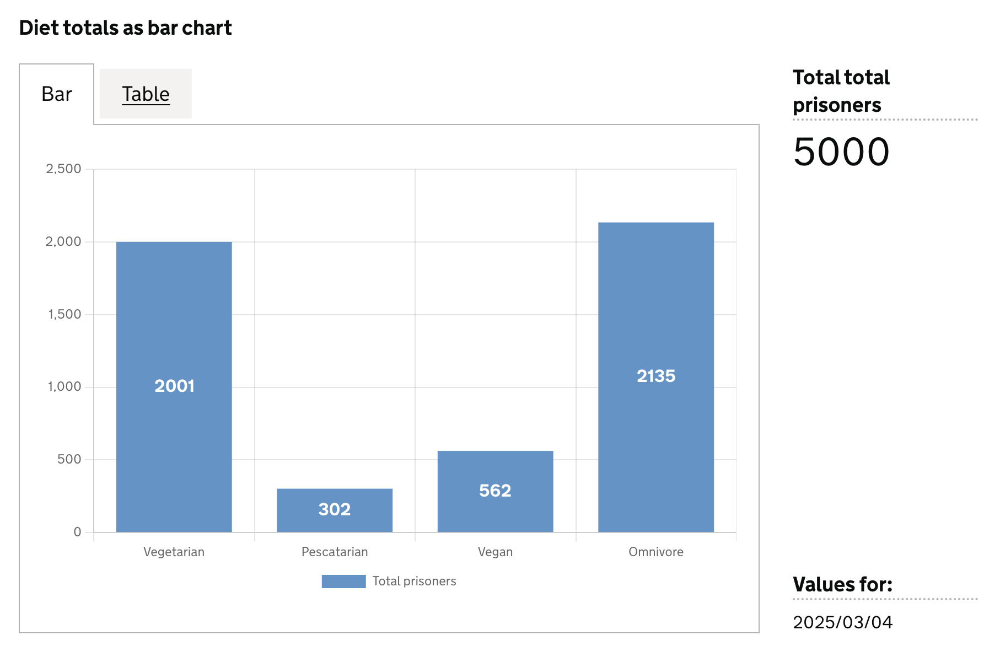

The `scorecard` chart visualisation type represents data as a scorecard visualisation. 

- [When to use](#when-to-use)
- [How it works](#how-it-works)
- [Definition](#definition)
- [Data assumptions](#data-assumptions)
- [Examples](#examples)

<hr class='dpr-docs-hr'/>

# When to use

Use this visualisation type when you need to display data as a **single** scorecard.

A scorecard is used to display:

- A snapshot value of a data point at a specific point in time, in an impactful way.
- The data trend over time, within a user selected date range.
- The RAG status for the data point value.

Use [scorecard group]() when:

- You want to display a group of scorecards
- You want multiple rows in a data subset displayed as scorecards 

<hr class='dpr-docs-hr'/>

# How it works

TBD

<hr class='dpr-docs-hr'/>

# Definition

```js
{
  id: 'scorecard-definition-example',
  type: 'scorecard',
  display: 'scorecard title',
  description: 'scorecard visualisation description',
  options: {
    ...
  }
  columns: {
    ...
  }
}
```

See the [Targeting data](/dashboards/visualisations/targeting-data) for and how to target data with the `column`

### Options: 

```js
options: {
  ...
}
```

<hr class='dpr-docs-hr'/>

# Examples

- [Example 1](#example-1)
- [Example 2](#example-2)

### Example Dataset

For these examples we will use a mocked dataset representing diet totals. 

```js
| est_id | has_ethnicity | ethnicity_is_missing | has_religion | religion_is_missing |
|--------|---------------|----------------------|--------------|---------------------|
| MDI    | 407           | 485                  | 300          | 500                 |
| SLI    | 584           | 701                  | 280          | 320                 |
| LTI    | 729           | 725                  | 220          | 214                 |
| DAI    | 520           | 765                  | 220          | 214                 |
```

<hr class='dpr-docs-hr'/>


# Simple scorecard

TBD

### Definition

```js
{
  id: 'simple-scorecard',
  type: 'scorecard',
  display: 'Example scorecard',
  description: 'Example definition description',
  columns: {
    keys: [
      {
        id: 'establishment_id',
      },
    ],
    measures: [
      {
        id: 'has_nationality',
        display: 'No of prisoners with nationality',
      },
    ],
  },
}
```

### Dataset returned: 

This definition will return the following dataset
```js

```
see [here](/dashboards/visualisations/targeting-data) for more info on targeting data

<hr class='dpr-docs-hr'/>

### Visualisation



<hr class='dpr-docs-hr'/>

# Example 2

TBD

### Definition

```js
{
  id: 'example-1',
  type: 'vis-type',
  display: 'Example definition',
  description: 'Example definition description',
  options: {},
  columns: {
    keys: [],
    measures: [],
    filters: []
    expectNulls: true,
  },
}
```

### Dataset returned: 

This definition will return the following dataset
```js

```
see [here](/dashboards/visualisations/targeting-data) for more info on targeting data

<hr class='dpr-docs-hr'/>

### Visualisation


